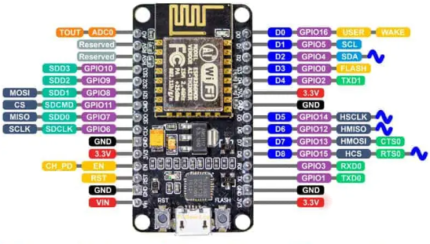

# Môj projekt pre SOŠ: ESP8266 Smart Flowerpot

## Zariadenia
- ESP8266 (NodeMCU alebo iný modul)
- TFT displej 2.4" ST7789 (240×320 px, bez dotyku)
- DHT11 senzor (teplota + vlhkosť)
- Senzor vlhkosti pôdy (analógový)
- Vodné čerpadlo + relé modul

## Pripojenie pinov

### 1. TFT ST7789 – ESP8266
- Piny v zátvorke sú pre čip, nie pre nás :D
| Komponent          | ESP8266 pin     | Popis                             |
|--------------------|-----------------|-----------------------------------|
| **LED**            | 3.3V            | Podsvietenie LED diód (prepojka)  |
| **SCK**            | D5 (GPIO14)     | SPI Clock                         |
| **MOSI**           | D7 (GPIO13)     | SPI MOSI                          |
| **DC (Data/Cmd)**  | D1 (GPIO5)      | Data/Command riadiaci vstup       |
| **RESET**          | D4 (GPIO2)      | Hardvérový reset displeja         |
| **CS (Chip Sel.)** | D2 (GPIO4)      | Chip-Select                       |
| **VCC**            | 3.3 V           | Napájanie displeja                |
| **GND**            | GND             | Zem                               |

> **Upozornenie:** v pôvodnom kóde bolo
> ```cpp
> #define TFT_CS   D2
> #define TFT_RST  D4
> #define TFT_DC   D1
> ```  
> takže teraz to je funkčnéé :D

---

### 2. DHT11 – ESP8266
| Komponent    | ESP8266 pin | Popis                         |
|--------------|-------------|-------------------------------|
| **VCC**      | 3.3 V       | Napájanie                     |
| **GND**      | GND         | Zem                           |
| **DATA**     | D4 (GPIO2)  | Digitálny výstup dát          |

> Takže v kóde bude:  
> ```cpp
> #define DHTPIN     2
> #define DHTTYPE DHT11
> ```

---

### 3. Senzor vlhkosti pôdy
| Komponent              | ESP8266 pin | Popis                         |
|------------------------|-------------|-------------------------------|
| **VCC**                | 3.3 V       | Napájanie                     |
| **GND**                | GND         | Zem                           |
| **Analógový výstup**   | A0          | Analógový vstup ESP8266       |

---

### 4. Čerpadlo (12 V) + relé modul
| Komponent            | ESP8266 pin  | Popis                          |
|----------------------|--------------|--------------------------------|
| **Relé IN**          | D3 (GPIO0)   | Riadiaci pin relé              |
| **Relé COM**         | +12 V zdroj  | Napájanie čerpadla (spoločný)  |
| **Relé NO**          | Vodné čerpadlo | Spína sa pri aktivácii relé  |
| **Relé GND**         | GND          | Zem relé modulu                |

---

## Fotka esp8266 pinov


## Tipy na doladenie
1. **EEPROM** – môžeš si uložiť nastavenie `wateringAmount` a načítať ho po reštarte.  
2. **Tlačidlá** – pridaj 2–3 tlačidlá (UP/DOWN/ENTER) napr. na D8, D0, D3 a umožni meniť množstvo vody cez menu.  
3. **Debug výpis** – `Serial.println()` ti pomôže overiť, či čítaš správne hodnoty senzorov a ovládaš relé.
